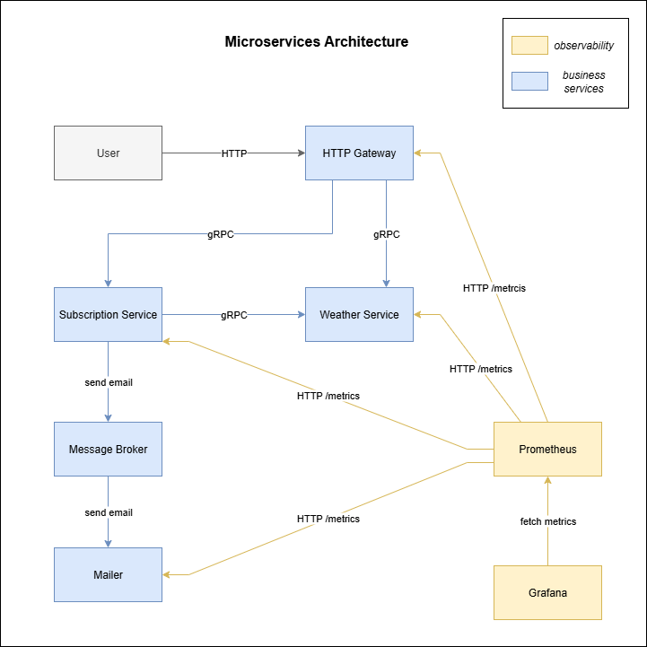

# ADR-0010: Microservices Communication Strategy — gRPC vs Message Broker

## Status

- Date: 07.07.2025
- Status: Accepted
- Author: Artur Kliuchka

## Context

We are splitting our monolithic backend into microservices:

- Subscription Service
- Weather Service
- Mailer Service

A key decision is how these services should communicate. 
Two main options were considered:

1. gRPC — synchronous RPC calls with strong typing.
2. Message Broker — asynchronous event-driven communication.

## Decision

We chose Message Broker for inter-service communication because:

- It provides reliable, asynchronous message delivery, buffering messages if a service is down.
- Supports loose coupling, allowing services to operate independently.
- Handles high throughput and bursty workloads effectively.
- Fits well with eventual consistency model needed for data synchronization.

While gRPC offers low latency synchronous calls, it lacks built-in retry and buffering, causing potential message loss if a service is unavailable. This makes it less suitable for critical events like subscription updates and bulk email notifications.

## Consequences

- Each service owns its database and synchronizes data via events on the broker.
- Events like SubscriptionCreated trigger updates across services.
- Mailer Service consumes email events asynchronously for scalability and reliability.
