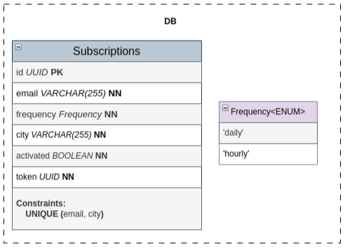

# System Design: Weather Subscription Service

## 1. System Requirements

### Functional

- Users can subscribe to weather updates for a specific city
- The system should send notifications to users' emails (hourly, daily)
- The user should be able to unsubscribe
- Users should be able to subscribe to a weekly weather forecast.
- In case of problems, the user should be able to contact support

### Non-Functional

- **Reliability**: emails should be delivered within 3 minutes of the specified time
- **Completeness**: If the system fails and a weather update message cannot be delivered, notify the user.
- **Resiliency**: in the event of a complete failure, the system must fully recover and perform a requeue
- **Security**: the system must withstand various types of cyber attacks
- **Auditability**: the system thoroughly collects all errors and logs for further manual analysis, or for use in analytics

### Constraints

- External weather API limit: 1.000.000 per month
- Budget: 0$ (pet project)

## 2. System load

- Active users < 20
- Subscriptions per user 1-10

## 3. High-level Architecture

**The system is composed of three internal services and two external dependencies:**

- `User` interacts with the system via the public API to manage subscriptions and receives weather updates by email.

- `API service` handles subscription creation, confirmation, and unsubscription. It stores data in the database, validates city names via the Weather API, and sends confirmation links through the SMTP server.

- `Cron service` runs continuously and periodically executes scheduled tasks. It loads active subscriptions from the database, fetches weather data from the Weather API, and sends weather updates to users via the SMTP server.

- `DB` stores subscription data: email, city, delivery frequency (daily/hourly), activation status, and token.

- `External Weather API` provides current weather data used for city validation and notifications.

- `External SMTP server` delivers confirmation and weather update emails to users.

## 4. DB schema

## 5. API endpoints

All routes are prefixed with `/api`.

| Method | Endpoint              | Description                                                                |
|--------|-----------------------|----------------------------------------------------------------------------|
| GET    | `/weather`            | Get current weather for a given city. Requires `?city=CityName` query.     |
| POST   | `/subscribe`          | Subscribe a user to weather updates. Expects JSON body with email, city, and frequency (`hourly` or `daily`). |
| GET    | `/confirm/:token`     | Confirm a subscription via token received by email.                        |
| GET    | `/unsubscribe/:token` | Unsubscribe from weather notifications using the token.                    |
